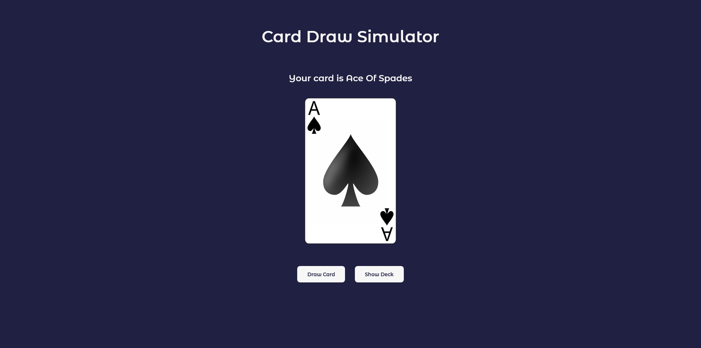
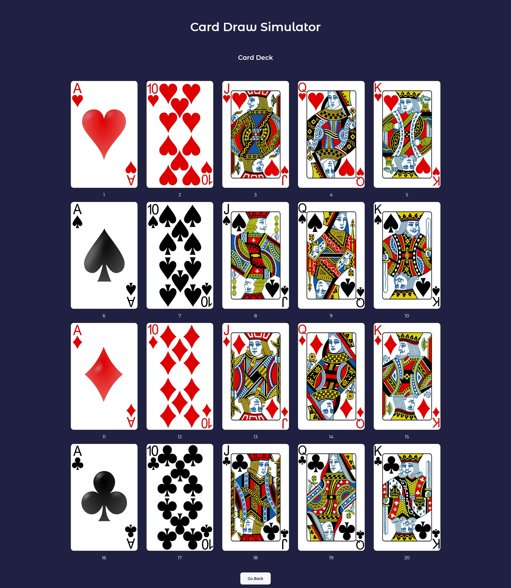

# Card Draw Simulator App

This is a Card Draw Simulator App that I've made in React.

What it does is it draws a random card from the card deck. The deck is stored in a separate file, it's an array of an objects, each card being an object with it's own id, title and graphic.
The projects also uses React Router - it has the main page on which You draw a card and a second one - card deck, which shows all the cards in the deck. Cards in the deck are displayed dynamically, so in case there was a card added to the card deck file it will show on the page automatically.

## Overview

### The challenge

### Screenshot

### Links

- Live Site URL: [HERE](https://radoslawlagan.github.io/Card-draw-simulator-app/)

## My process

### Built with

- HTML5
- CSS
- Flexbox
- Mobile First
- RWD
- React
- React Router
